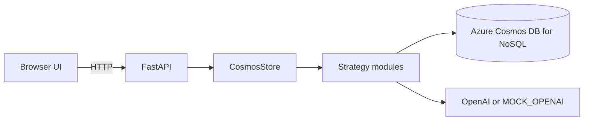

# Architecture

## Overview

The app is a single FastAPI service that serves a static browser UI and persists strategy-specific memory state in Azure Cosmos DB for NoSQL.

Runtime components:

- `frontend/`: browser UI for choosing strategy, session, and baseline reset
- `backend/main.py`: API routes and static file hosting
- `backend/storage/cosmos_client.py`: Cosmos/OpenAI lifecycle plus strategy dispatch
- `backend/strategies/*.py`: the four memory patterns
- `scripts/provision_cosmos.py`: container creation and indexing setup

## Runtime Diagram

## Containers

All containers use `/session_id` as the partition key.

| Container | Purpose |
|---|---|
| `direct_llm_sessions` | metadata for baseline sessions |
| `sliding_window_sessions` | session metadata, recent messages, rolling summary |
| `hierarchical_sessions` | session metadata, messages, tier-2 summaries, tier-3 facts |
| `entity_graph_sessions` | entity-graph session metadata and recent messages |
| `entity_graph_entities` | structured entity/fact documents for retrieval |

Partitioning on `session_id` keeps the hot path scoped to a single session.

## Per-Turn Flow

For every `POST /api/chat` request:

1. The API resolves the selected strategy.
2. The strategy reads the minimum Cosmos state needed for the turn.
3. The strategy injects that state into the prompt.
4. The strategy calls OpenAI once for the reply.
5. The strategy writes the assistant turn and any derived memory artifacts back to Cosmos.
6. The API returns the reply and metrics.

## Strategy Differences

| Strategy | Stored memory | Retrieval behavior |
|---|---|---|
| Direct LLM | `turn_count`, `last_ts` | none |
| Sliding Window | recent `msg` docs plus a single summary field | fixed recent window plus summary |
| Hierarchical | recent `msg` docs, tier-2 summary docs, tier-3 facts doc | tiered recall with compaction |
| Entity Graph | recent `msg` docs plus entity docs | vector/full-text retrieval over structured facts |

## Entity Graph Retrieval

Entity Graph uses native Cosmos capabilities only:

- vector search when `COSMOS_ENABLE_VECTOR_SEARCH=true`
- full-text search when `COSMOS_ENABLE_FULL_TEXT_SEARCH=true`
- hybrid rank fusion when both are enabled

If both are disabled, the strategy fails fast rather than using an in-app keyword fallback.

## Public API Surface

| Method | Path | Purpose |
|---|---|---|
| `POST` | `/api/chat` | run a turn |
| `GET` | `/api/memory/{strategy}/{session_id}` | inspect stored memory |
| `GET` | `/api/sessions/{strategy}` | list sessions for the UI |
| `DELETE` | `/api/sessions/{strategy}/{session_id}` | delete one session |
| `POST` | `/api/baseline/reset` | reseed the canonical 60-turn baseline |
| `GET` | `/api/baseline/reset/{job_id}` | poll background reset status |
| `DELETE` | `/api/all-data` | delete all stored data |

## Baseline Seeding

The canonical baseline is a sanitized 60-turn conversation stored in `scripts/default_seed_messages.json`.

`scripts/load_test_data.py --force` seeds the four fixed `test-*` sessions used for comparison. The UI surfaces drift above 60 turns as a warning instead of a hard stop so the app stays usable after the baseline has been extended.
